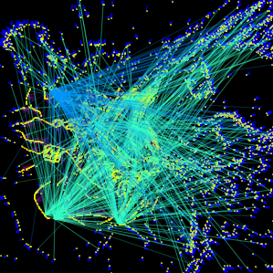

# perception
A Web Page Demo of My Theory of Memory Formation and Perception

The contents of the zip can be exploded to a web directory and accessed by a browser.
Since it involves some graphic images that will be perceived by the script and since it uses canvas, the cross site limitations require it be served over the network using https:// as in https://jerrywaese.ca/neurons/
During initialization the script builds a million neurons both modeling cortical and pyramidal neurons with a thousand branches per each pyramidal neuron.
After any of a number of images are loaded they are rendered as activated neurons and nearby pyramidal neurons build spines on active neurons that they connect with.
Then partial perception is randomly enabled using a portion of the original image which becomes a pattern of active cortical neurons, and the script activates pyramidals in that  active portion, and where 3 or more of these pyramidals branches reach a resting cortical neuron it is reactivated.
In this way much of the whole original image is reactivated.
Right clicking shows the branches that have contributed to a reactivated position on the screen and left clicking shows a pyramidal neurons's activev branches.

 
The code is written using biological terms as names of functions and arrays.

